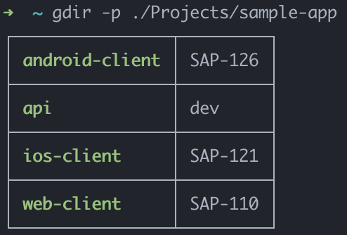
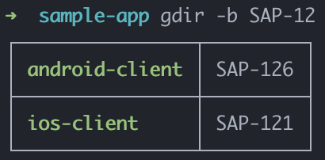
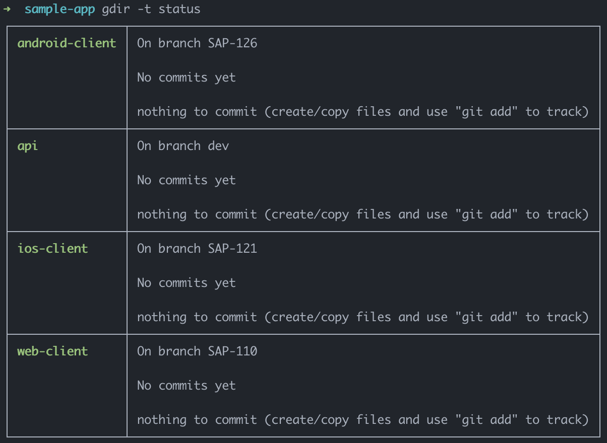

# Git Dir
A command line tool to list git directories with their current branches or statuses.

## Installation
`gdir` can be installed as a global command using npm and github.
```sh
$ npm install -g nishanbajracharya/gdir
```

## Usage
The basic usage of `gdir` is to run the supplied command in a terminal session.
```sh
$ gdir
```
This will list down all the directories with git repos in the current path and the current git branch of each repo.

### Options
`gdir` comes with a few options that can be used to filter branches or show statuses instead

#### Path
Path of directory to check repos in.

**Option**: `-p, --path`

**Default**: `.` *Represents current directory*

```sh
$ gdir --path path/to/directory
$ gdir -p ~/github
```



#### Branch
Git branch to filter.

**Option**: `-b, --branch`

**Default**: ` ` *Represents current branch*

```sh
$ gdir --branch DEV-123
```
Shows any directory that are checked into `DEV-123` branch.

```sh
$ gdir --branch DEV-
```
Shows any directory that match the `DEV-` string like `DEV-`, `DEV-1`, etc.

```sh
$ gdir -b dev
```
Shows any directory that match `dev` branch name.




#### Type
Show current branch or status

**Option**: `-t, --type` *Choices: `branch`, `status`*

**Default**: `branch`

```sh
$ gdir --type branch
```
Shows list of directories and their corresponding current branches

```sh
$ gdir -t status
```
Shows list of directories and their current branch statuses



##### Note: All options can be used in combination
```sh
$ gdir --path ~/github --branch dev --type status
```

## Contributing
To contribute, follow one of the two options:

- **Open an Issue**

  Open an issue detailing:
  1. What the issue is
  2. Steps to reproduce
  3. Possible solutions

  Note: These details are recommended but are entirely optional.

- **Send a Pull Request**

  Fork this project and send a pull request to the `main` branch.

## License
MIT